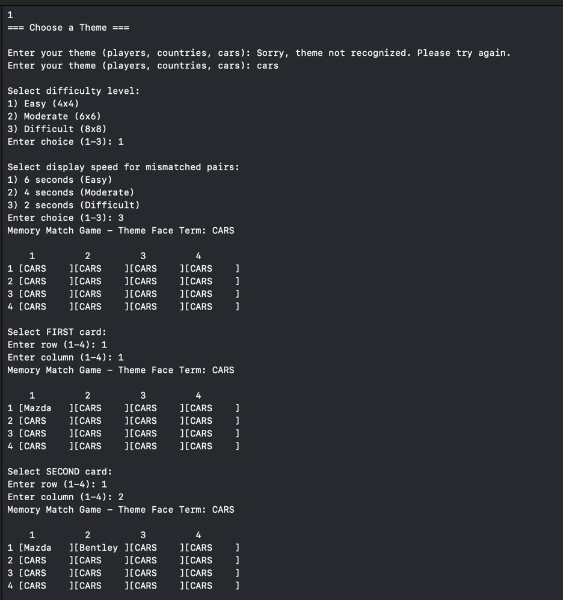

# Academic & Practice Code Portfolio

A collection of foundational programming projects and practice scripts written in C++ and Java.

---

##  C++ Memory Matching Game

An object-oriented terminal game implementing custom state logic, dynamic grid scaling, theme selection, and configurable game loop delays.

### Gameplay Demo

### Core Features
* **Dynamic Grid Sizing:** Supports Easy (4x4), Moderate (6x6), and Difficult (8x8) matrix configurations.
* **Theme Engine:** Built-in word banks for topics such as Cars, Players, and Countries.
* **Loop Delays:** Customizable display speeds for mismatched pairs using standard `<chrono>` and `<thread>` timers.

---

##  Java Calculator

A Java-based arithmetic calculator application demonstrating basic OOP principles and UI/console interaction.

* Located in: `/java-calculator`

---

## 🧪 Practice & Test Scripts

A collection of introductory scripts, syntax exercises, and environment test builds.

* **`practice/Hello.cpp`** - Basic C++ environment test script.
* **`practice/Hello.java`** - Basic Java compilation test script.

---

## 🛠️ Build & Execution

### Compile C++ Memory Game
